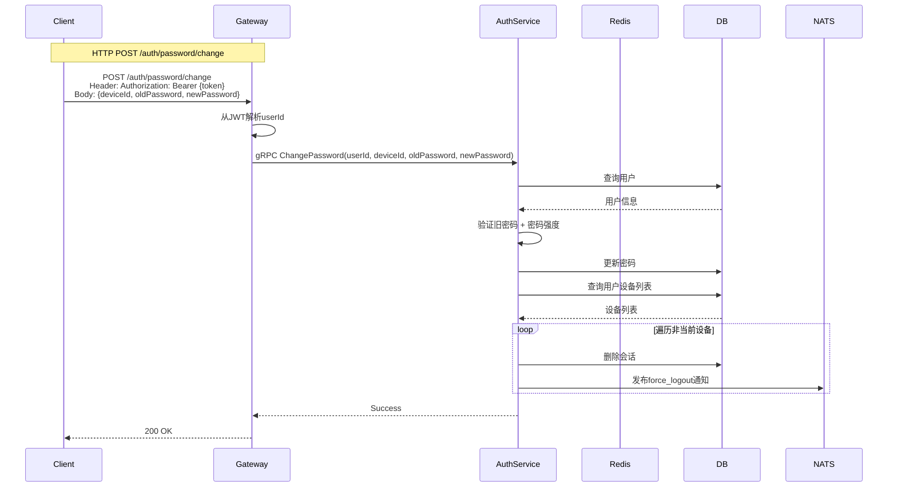
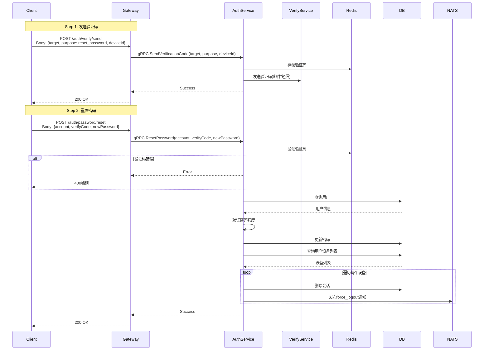

# 密码管理设计

## 1. 概述

密码管理提供修改密码和忘记密码功能，保障用户账号安全。

## 2. 功能列表

- [x] 修改密码（已登录）
- [x] 忘记密码（验证码重置）
- [x] 密码强度校验

## 3. 修改密码

### 3.1 业务流程



### 3.2 API

**HTTP 接口**

```
POST /auth/password/change
Content-Type: application/json
Authorization: Bearer {access_token}

Request:
{
    "deviceId": "device-uuid-123",
    "oldPassword": "oldpass123",
    "newPassword": "NewPass123"
}

Response:
{
    "code": 0,
    "message": "success",
    "data": null
}
```

**gRPC 接口**

```protobuf
message ChangePasswordRequest {
    string user_id = 1;
    string device_id = 2;
    string old_password = 3;
    string new_password = 4;
}
```

### 3.3 错误码

| 错误码 | 说明 |
|--------|------|
| 10105 | 旧密码错误 |
| 10103 | 新密码强度不足 |

## 4. 忘记密码

### 4.1 业务流程



### 4.2 API

**HTTP 接口**

```
POST /auth/password/reset
Content-Type: application/json

Request:
{
    "account": "13800138000",
    "verifyCode": "123456",
    "newPassword": "NewPass123"
}

Response:
{
    "code": 0,
    "message": "success",
    "data": null
}
```

**gRPC 接口**

```protobuf
message ResetPasswordRequest {
    string account = 1;
    string verify_code = 2;
    string new_password = 3;
}
```

### 4.3 错误码

| 错误码 | 说明 |
|--------|------|
| 10206 | 验证码错误 |
| 10207 | 验证码已过期 |
| 10104 | 用户不存在 |
| 10103 | 新密码强度不足 |

### 4.4 验证码用途

| 用途 | 说明 |
|------|------|
| register | 注册验证码 |
| reset_password | 重置密码 |
| bind_phone | 绑定手机 |
| bind_email | 绑定邮箱 |
| change_phone | 更换手机 |
| change_email | 更换邮箱 |

## 5. 密码强度规则

- 8~32位
- 必须包含大小写字母
- 必须包含数字

## 6. 强制下线机制

### 6.1 触发场景

| 场景 | 说明 |
|------|------|
| 修改密码 | 当前设备外所有其他设备强制下线 |
| 重置密码 | 所有设备强制下线 |

### 6.2 通知消息

强制下线时发送 `auth.force_logout` 通知，推送到用户所有在线设备：

**通知主题**: `notification.auth.force_logout.{user_id}`

**Payload**:

```json
{
    "type": "auth.force_logout",
    "user_id": "user-uuid",
    "priority": "high",
    "payload": {
        "device_id": "device-uuid",
        "device_type": "ios",
        "reason": "password_changed",
        "timestamp": 1704067200
    }
}
```

| 字段 | 类型 | 说明 |
|------|------|------|
| type | string | 固定为 `auth.force_logout` |
| user_id | string | 用户ID |
| priority | string | 优先级 `high` |
| payload.device_id | string | 被下线的设备ID |
| payload.device_type | string | 设备类型 |
| payload.reason | string | 下线原因：`password_changed` / `password_reset` |
| payload.timestamp | int64 | 时间戳 |

### 6.3 安全考虑

1. **密码存储**: bcrypt 加密
2. **传输安全**: HTTPS 传输
3. **历史记录**: 可选记录密码历史防止重复
4. **强制下线**: 密码修改后其他设备需要重新登录
