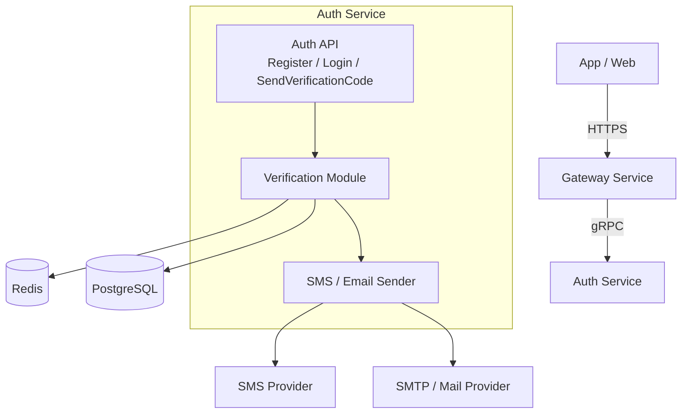
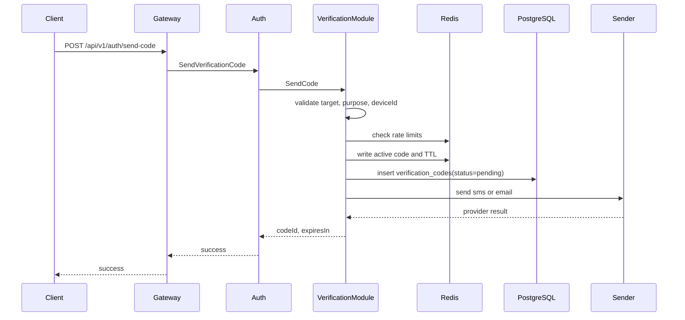
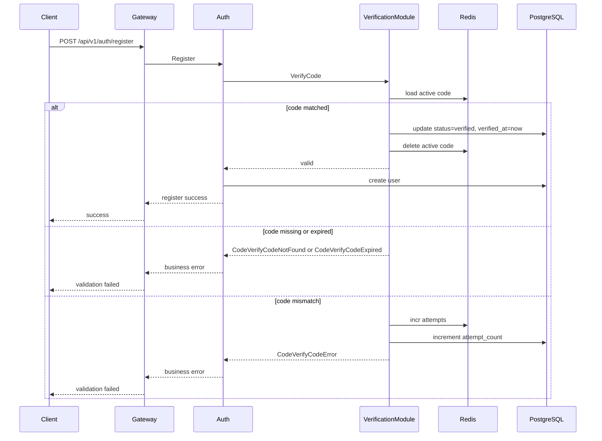

# 验证码能力设计

## 1. 目标与范围

验证码能力用于认证相关场景的人机确认与目标归属校验，当前覆盖以下用途：

- `register`：注册账号
- `reset_password`：重置密码（已实现）
- `bind_phone` / `change_phone`：绑定或更换手机号（设计文档：[bind-phone.md](bind-phone.md)、[change-phone.md](change-phone.md)）
- `bind_email` / `change_email`：绑定或更换邮箱（设计文档：[bind-email.md](bind-email.md)、[change-email.md](change-email.md)）
- `login`：必要时可扩展为高风险登录校验

该能力由 `auth-service` 负责，对外通过 Auth 接口暴露，对内作为认证流程的一部分完成校验与消费，不额外提供独立公共“验码接口”。

设计目标：

1. 将发码、验码与认证主流程保持在同一业务边界内。
2. 保证验证码只保存哈希值，不在缓存、数据库、日志中落明文。
3. 同时满足实时校验、频控、审计追踪和供应商扩展能力。
4. 为本地开发、联调测试和生产环境提供清晰的行为边界。

## 2. 总体架构



职责划分：

- **Gateway**：暴露 HTTP API，转发到 Auth gRPC。
- **Auth API**：承接注册、登录、发送验证码等认证请求。
- **Verification Module**：负责目标校验、频控、生成验证码、哈希、发送、验码、核销。
- **Redis**：保存活跃验证码和限流计数，承担实时读写。
- **PostgreSQL**：保存审计记录、模板配置和发送状态。
- **Sender**：抽象短信、邮件发送通道，便于后续接入真实供应商。

代码组织与当前仓库保持一致：

- `internal/auth/service/auth_service.go`
- `internal/auth/service/verification_service.go`
- `internal/auth/sender/smtp_email_sender.go`
- `internal/auth/repository/verification_code_repository.go`
- `internal/auth/repository/verification_template_repository.go`
- `internal/auth/model/verification_code.go`
- `internal/auth/model/verification_template.go`
- `internal/auth/dto/auth.go`
- `internal/auth/dto/verification.go`

## 3. 数据设计

### 3.1 设计原则

- 不存明文验证码，只保存 `code_hash`。
- 同一 `target + purpose` 同时只允许一个有效验证码。
- Redis 存活跃态，依赖 TTL 自动过期。
- PostgreSQL 存审计态，用于排障、统计和风控回溯。
- 实时错误次数以 Redis 为准，数据库中的 `attempt_count` 用于留痕。

### 3.2 PostgreSQL

验证码记录保存在 `verification_codes` 表，关键字段如下：

- `code_id`：验证码唯一标识
- `target` / `target_type`：手机号或邮箱，以及目标类型
- `purpose`：业务用途，如 `register`
- `code_hash`：验证码哈希值
- `status`：`pending`、`verified`、`expired`、`locked`、`cancelled`
- `expires_at` / `verified_at`：过期和核销时间
- `send_ip` / `send_device_id`：发送来源
- `attempt_count`：累计错误次数审计字段
- `provider` / `provider_message_id`：渠道和回执

模板可选地保存在 `verification_templates` 表中，用于短信/邮件内容管理。

### 3.3 Redis

为避免在 Key 中暴露手机号或邮箱，目标值先做 SHA-256：

```text
auth:vc:{purpose}:{target_hash}
  fields: code_id, code_hash, target_type, expires_at, attempts, max_attempts, device_id
  ttl: 300s

auth:vc:rl:target:{purpose}:{target_hash}:1m
auth:vc:rl:target:{purpose}:{target_hash}:24h
auth:vc:rl:ip:{ip}:1h
auth:vc:rl:device:{device_id}:24h
```

验证码哈希使用：

```text
HMAC-SHA256(secret, purpose + ":" + target + ":" + code)
```

## 4. 接口设计

### 4.1 发码接口

gRPC：

```protobuf
rpc SendVerificationCode(SendVerificationCodeRequest) returns (SendVerificationCodeResponse);
```

HTTP：

```http
POST /api/v1/auth/send-code
```

请求示例：

```json
{
  "target": "13800138000",
  "targetType": "sms",
  "purpose": "register",
  "deviceId": "ios-uuid"
}
```

响应示例：

```json
{
  "code": 0,
  "message": "success",
  "data": {
    "codeId": "vc_20260405_xxx",
    "expiresIn": 300
  }
}
```

### 4.2 验码方式

验证码不作为独立公共接口消费，而是在具体认证动作中完成校验：

- `POST /api/v1/auth/register`
- 后续可扩展到找回密码、绑定手机、绑定邮箱等接口

这样可以把“验证码校验”和“业务动作执行”放到同一认证边界内，减少中间态暴露。

## 5. 核心流程

### 5.1 发送验证码

1. 校验 `target`、`targetType`、`purpose`、`deviceId`。
2. 在 Redis 上执行目标、IP、设备三类频控。
3. 取消当前 `target + purpose` 下的旧验证码。
4. 生成验证码：生产环境使用随机数字码；非 `release` 环境可使用固定调试码。
5. 计算 `code_hash`，写入 Redis 活跃态。
6. 写入 PostgreSQL 审计记录，状态为 `pending`。
7. 调用短信或邮件发送器。
8. 发送失败时删除 Redis 活跃态，并将数据库状态更新为 `cancelled`。

### 5.2 校验并消费验证码

1. 注册、重置密码等请求进入 Auth。
2. 业务层根据手机号或邮箱解析出校验目标。
3. 从 Redis 读取当前活跃验证码。
4. 比对 `code_hash`；失败时递增 Redis `attempts`，并同步增加数据库 `attempt_count`。
5. 达到 `max_attempts` 后删除活跃态，并将状态置为 `locked`。
6. 验证成功后更新数据库状态为 `verified`，记录 `verified_at`，随后删除 Redis 活跃态。
7. 继续执行注册、改密等主业务逻辑。

### 5.3 重发行为

- 同一目标在有效期内再次发码时，旧验证码立即失效。
- 后续验码只认最后一次成功写入 Redis 的验证码。

## 6. 时序图与异常分支说明

### 6.1 发码时序图



### 6.2 验码并消费时序图



### 6.3 异常分支说明

- **频控命中**：在写入活跃验证码前返回 `CodeSendRateLimited` 或 `CodeSendLimitReached`，不创建新的验证码记录。
- **发送渠道失败**：删除 Redis 活跃态，并将数据库状态更新为 `cancelled`，避免出现“可校验但未真正送达”的状态。
- **验证码过期**：读取活跃态时发现已过期，则删除 Redis Key，并将数据库状态更新为 `expired`。
- **连续输错锁定**：每次输错递增 `attempts`；达到 `max_attempts` 后删除活跃态，并将数据库状态更新为 `locked`。
- **重复发送**：同一 `target + purpose` 再次发码时，旧验证码先被取消，新验证码覆盖生效。
- **主流程失败**：验码成功后即视为已消费；如果后续注册或改密失败，验证码不会恢复可用状态，调用方需重新申请。
- **开发环境固定码**：非 `release` 环境允许使用 `debug_fixed_code`，便于联调和自动化测试；生产环境不启用该行为。

## 7. 安全与风控

默认安全要求：

1. 不在 Redis、PostgreSQL、日志中保存明文验证码。
2. 日志中输出手机号、邮箱时必须脱敏。
3. Redis Key 不直接暴露手机号、邮箱。
4. 校验失败、频控触发、渠道失败都需要记录结构化日志。
5. 渠道调用超时、失败率升高、频控异常应具备独立告警。

默认风控参数：

| 维度 | 默认值 |
|------|--------|
| 同一 target + purpose | 60 秒 1 次，24 小时 10 次 |
| 同一 IP | 1 小时 200 次 |
| 同一 device_id | 24 小时 100 次 |
| 同一验证码最大错误次数 | 5 次 |
| 验证码有效期 | 300 秒 |

## 8. 环境与配置

验证码配置由 `auth-service` 加载，当前配置结构如下：

```yaml
verify:
  code:
    length: 6
    expire_seconds: 300
    max_attempts: 5
    hash_secret: ${VERIFY_CODE_HASH_SECRET:change-me-for-production}
    debug_fixed_code: ${VERIFY_DEBUG_FIXED_CODE:123456}
    allow_dev_bypass: ${VERIFY_ALLOW_DEV_BYPASS:true}
  rate_limit:
    target_per_minute: 1
    target_per_day: 10
    ip_per_hour: 200
    device_per_day: 100
```

环境约束：

- `release` 环境必须使用随机验证码，不依赖调试绕过能力。
- 非 `release` 环境允许使用 `debug_fixed_code` 进行联调。
- `allow_dev_bypass=true` 时，本地环境可直接使用固定码通过验码逻辑。
- 当 `verify.email.host` 未配置或仍为占位值 `smtp.example.com` 时，不启用真实 SMTP 发信，邮箱验证码仅保留本地日志/测试行为。

### 8.1 SMTP 邮箱服务配置说明

要启用真实邮箱验证码发送，需要为 `auth-service` 配置 SMTP 参数。最常见的两种端口模式：

- `465`：SMTP over SSL，服务启动后直接走 TLS
- `587`：SMTP Submission，连接后通过 STARTTLS 升级

推荐优先使用邮箱服务商提供的 **SMTP 授权码 / App Password**，不要直接使用邮箱登录密码。

关键配置项说明：

- `verify.email.host`：SMTP 服务器地址，例如 `smtp.qq.com`
- `verify.email.port`：SMTP 端口，常用 `465` 或 `587`
- `verify.email.username`：SMTP 登录账号，通常是完整邮箱地址
- `verify.email.password`：SMTP 授权码或应用专用密码
- `verify.email.from_name`：发件人展示名称
- `verify.email.from_address`：发件邮箱地址，通常需要与登录账号一致或属于同一发信域

环境变量示例：

```bash
export EMAIL_HOST=smtp.qq.com
export EMAIL_PORT=465
export EMAIL_USERNAME=your_account@qq.com
export EMAIL_PASSWORD=your_smtp_auth_code
export EMAIL_FROM_NAME=AnyChat
export EMAIL_FROM_ADDRESS=your_account@qq.com
```

也可以直接在配置文件中填写：

```yaml
verify:
  email:
    host: smtp.qq.com
    port: 465
    username: your_account@qq.com
    password: your_smtp_auth_code
    from_name: AnyChat
    from_address: your_account@qq.com
```

配置完成后需要重启 `auth-service`。启动日志中出现 `SMTP email sender enabled`，表示真实邮箱发信能力已启用。

## 9. 可观测性与测试

建议记录以下指标与日志：

- 发码成功率、失败率、渠道耗时
- 频控命中次数
- 验码成功率、失败率、锁定次数
- 不同 `purpose` 的调用量分布

当前仓库中的验证重点：

- 单元测试：验证码生成、限流、过期、锁定、重复发送
- API 测试：`tests/api/auth/test-auth-api.sh`
  - 发送短信/邮箱验证码
  - 目标格式校验
  - 发送频率限制
  - 错误验证码注册失败
  - 固定验证码注册成功

## 10. 扩展方向

后续可按需扩展：

- 接入真实短信/邮件供应商并记录回执状态
- 基于业务用途配置不同模板与频控策略
- 为高风险登录、设备变更提供二次校验
- 将验证码事件接入审计或风控平台

以上方案将验证码能力定义为 Auth 域内的基础认证能力，重点保障安全、实时性、可审计性和实现边界清晰。
