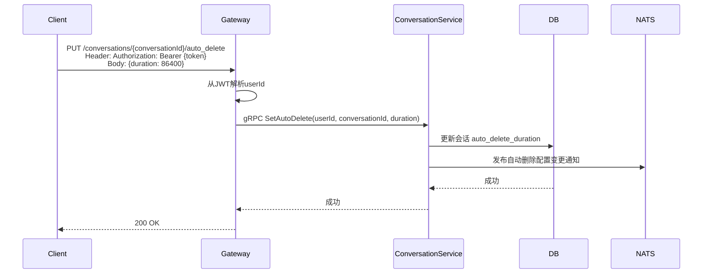
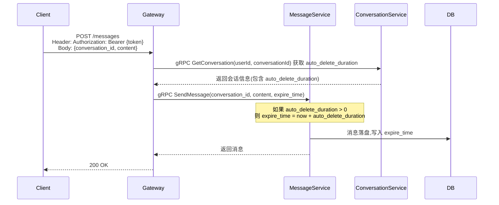
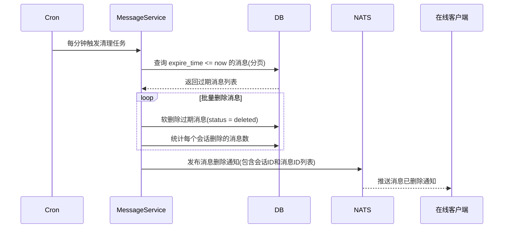

# 自动删除消息（Auto-Delete）

## 1. 功能定义

用户可以为整个会话（私聊、群组）设置一个全局统一的自动删除计时器。开启后，该会话中所有新发送的消息都会在存活达到设定时长时被自动删除（包括本地和服务器端）。

### 核心特性

- **作用范围**：整个会话，所有成员的新消息都遵循同一规则
- **计时起点**：消息发送成功的时间（服务器收到并落盘的时间戳）
- **计时时长**：用户自定义，支持预设选项（1小时、1天、1周、1个月）和自定义输入（秒、分钟、小时）
- **不追溯**：开启前的旧消息不会被自动删除

### 相对时长的含义

删除定时器的时长是相对于"消息的发送时间"计算的。

**举例**：
- 用户设置"24小时后自动删除"
- 在 2025-01-01 10:00:00 发送一条消息
- 该消息将在 2025-01-02 10:00:00 被系统自动删除
- 无论接收方是否已读、是否在线，计时起点均固定为发送时刻

## 2. 数据模型

### 2.1 会话表扩展

```go
type Conversation struct {
    // ... existing fields
    AutoDeleteDuration int32 `gorm:"column:auto_delete_duration;default:0"` // 自动删除时长(秒),0表示未启用
}
```

### 2.2 消息表扩展

```go
type Message struct {
    // ... existing fields
    ExpireTime *time.Time `gorm:"column:expire_time"` // 消息过期时间,为NULL表示永不过期
}
```

### 2.3 数据库字段

| 表名 | 字段名 | 类型 | 说明 |
|------|--------|------|------|
| conversations | auto_delete_duration | INT | 自动删除时长(秒),0表示未启用 |
| messages | expire_time | TIMESTAMPTZ | 消息过期时间戳 |

## 3. 业务流程

### 3.1 设置自动删除



> duration为0表示取消自动删除

### 3.2 消息发送时设置过期时间



### 3.3 定时清理任务



## 4. API设计

### 4.1 设置自动删除

```protobuf
message SetConversationAutoDeleteRequest {
    string user_id = 1;
    string conversation_id = 2;
    int32 duration = 3;  // 秒,0表示取消
}

message SetAutoDeleteResponse {
    int32 duration = 1;  // 当前设置的时长
}
```

### 4.2 HTTP接口

```
PUT /conversations/{conversationId}/auto_delete
Body: {"duration": 86400}  // 秒,0表示取消

Response: {"code": 0, "data": {"duration": 86400}}
```

### 4.3 预设时长选项

| 名称 | 时长(秒) |
|------|----------|
| 1小时 | 3600 |
| 6小时 | 21600 |
| 1天 | 86400 |
| 1周 | 604800 |
| 1个月 | 2592000 |

## 5. 通知设计

### 5.1 自动删除配置变更

- **通知类型**：`conversation.auto_delete_updated`
- **作用**：多端同步自动删除配置

```json
{
    "type": "conversation.auto_delete_updated",
    "payload": {
        "conversation_id": "xxx",
        "auto_delete_duration": 86400
    }
}
```

### 5.2 消息删除通知

- **通知类型**：`message.auto_deleted`
- **作用**：通知在线用户消息已被自动删除

```json
{
    "type": "message.auto_deleted",
    "payload": {
        "conversation_id": "single_user1_user2",
        "message_ids": ["msg1", "msg2", "msg3"]
    }
}
```

## 6. 定时任务设计

### 6.1 清理策略

- **执行间隔**：每分钟执行一次
- **批量大小**：每批处理 1000 条消息
- **索引优化**：使用 `expire_time` 索引加速查询
- **删除方式**：软删除（更新 status 字段）

### 6.2 实现要点

```go
type AutoDeleteWorker struct {
    messageRepo    repository.MessageRepository
    notificationPub notification.Publisher
    batchSize      int
}

// 清理逻辑：
// 1. SELECT id, conversation_id FROM messages 
//    WHERE expire_time IS NOT NULL AND expire_time <= now() 
//    ORDER BY expire_time LIMIT 1000
// 2. 批量更新这些消息的 status = MessageStatusDeleted
// 3. 按 conversation_id 分组，统计每个会话删除的消息数
// 4. 发布消息删除通知到每个会话的在线成员
```

### 6.3 性能优化

1. **索引优化**
   ```sql
   CREATE INDEX idx_messages_expire_time ON messages (expire_time) 
   WHERE expire_time IS NOT NULL;
   ```

2. **分页清理**：避免长时间锁表

3. **异步通知**：删除通知放入队列异步发送

## 7. 客户端表现

### 7.1 设置入口

会话详情页 → "自动删除消息" → 选择或输入时长

### 7.2 界面提示

开启后，聊天界面顶部常驻提示，例如：
- "消息将在 1 小时后自动删除"
- "消息将在 1 天后自动删除"

### 7.3 消息拉取

客户端拉取消息时，服务器已自动过滤过期消息（因为物理删除或查询时排除），客户端无需特殊处理。

## 8. 与阅后即焚的区别

| 特性 | 自动删除 | 阅后即焚 |
|------|---------|----------|
| 触发条件 | 计时器到期 | 接收方阅读后 |
| 作用对象 | 所有消息 | 单条消息 |
| 时效性 | 相对发送时间 | 相对阅读时间 |
| 典型场景 | Telegram Auto-Delete | 私密聊天 |