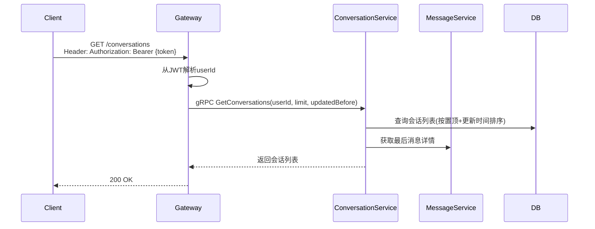
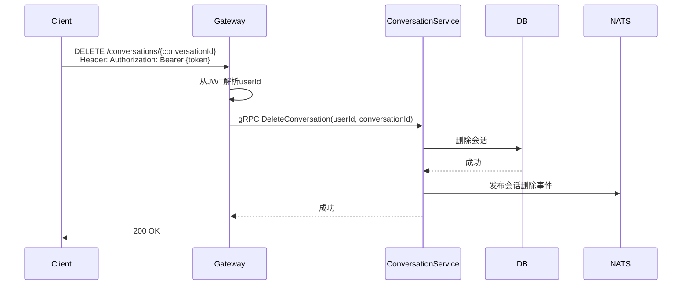
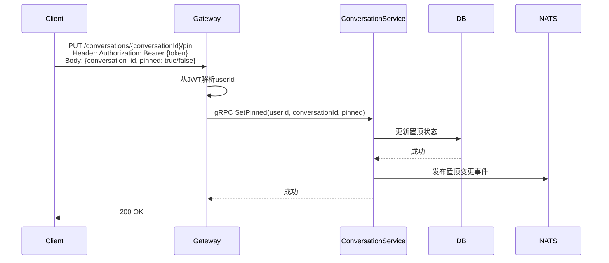
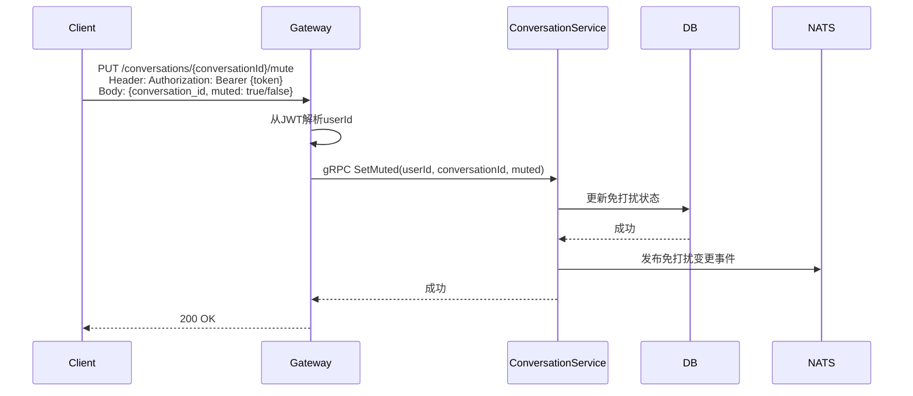

# 会话管理设计

## 1. 概述

会话管理提供会话列表、置顶、免打扰、未读数、阅后即焚、自动删除消息等核心功能。

## 2. 功能列表

- [x] [获取会话列表](./conversation.md#41-获取会话列表)
- [x] [创建/更新会话](./conversation.md#42-创建更新会话)
- [x] [删除会话](./conversation.md#43-删除会话)
- [x] [会话置顶](./conversation.md#44-会话置顶)
- [x] [会话免打扰](./conversation.md#45-会话免打扰)
- [x] [未读数管理](./conversation.md#46-未读数管理)
- [x] [阅后即焚](./conversation.md#47-阅后即焚)
- [x] [自动删除消息](./auto_delete.md)

## 3. 数据模型

### 3.1 Conversation 表

```go
type Conversation struct {
    ConversationID          string     // 会话ID
    ConversationType        string     // 会话类型: single/group/system
    UserID             string     // 用户ID
    TargetID           string     // 目标ID(用户或群组)
    LastMessageID      string     // 最后一条消息ID
    LastMessageContent string     // 最后消息摘要
    LastMessageTime    *time.Time // 最后消息时间
    UnreadCount        int32      // 未读数
    IsPinned           bool       // 是否置顶
    IsMuted            bool       // 是否免打扰
    PinTime            *time.Time // 置顶时间
    BurnAfterReading   int32      // 阅后即焚时长(秒),0表示未启用
    AutoDeleteDuration int32      // 自动删除时长(秒),0表示未启用
    CreatedAt          time.Time
    UpdatedAt          time.Time
}
```

## 4. 业务流程

### 4.1 获取会话列表

详见 [自动删除消息](./auto_delete.md) 文档。



### 4.2 创建/更新会话

消息到达时由消息服务调用，更新会话的最后消息信息。

### 4.3 删除会话



### 4.4 会话置顶



### 4.5 会话免打扰



### 4.6 未读数管理

- **增加未读数**：消息服务发送消息时调用
- **清除未读数**：用户查看会话时调用

### 4.7 阅后即焚

详见 [阅后即焚](./burn_after_reading.md) 设计文档。

## 5. API设计

### 5.1 获取会话列表

```protobuf
message GetConversationsRequest {
    string user_id = 1;
    int32 limit = 2;
    int64 updated_before = 3;
}

message GetConversationsResponse {
    repeated Conversation conversations = 1;
}
```

### 5.2 置顶/免打扰

```protobuf
message SetPinnedConversationRequest {
    string user_id = 1;
    string conversation_id = 2;
    bool pinned = 3;
}

message SetMutedConversationRequest {
    string user_id = 1;
    string conversation_id = 2;
    bool muted = 3;
}
```

### 5.3 阅后即焚

详见 [阅后即焚](./burn_after_reading.md) 设计文档。

### 5.4 自动删除消息

详见 [自动删除消息](./auto_delete.md) 文档。

## 6. 通知主题

- `notification.conversation.pin_updated.{user_id}` - 置顶状态变更
- `notification.conversation.mute_updated.{user_id}` - 免打扰状态变更
- `notification.conversation.deleted.{user_id}` - 会话删除
- `notification.conversation.unread_updated.{user_id}` - 未读数变更
- `notification.conversation.burn_updated.{user_id}` - 阅后即焚配置变更
- `notification.conversation.auto_delete_updated.{user_id}` - 自动删除配置变更