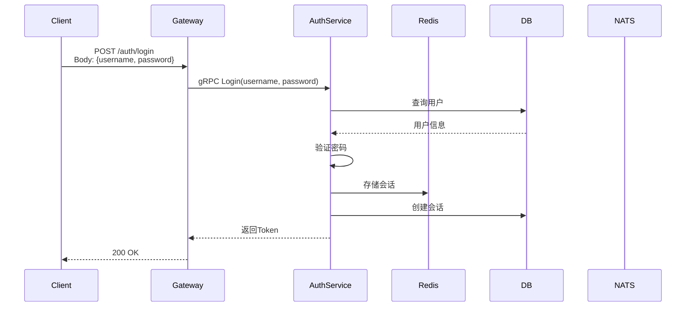

# 设计文档指南

本文档定义了 AnyChat 设计文档的统一规范，所有设计文档应遵循此规范。

## 时序图绘制原则

绘制业务流程时序图时，遵循以下参与者顺序：

```
Client → Gateway → Microservices → Redis → DB → NATS → MinIO
```

### 参与者说明

| 参与者 | 说明 |
|--------|------|
| Client | Web/Mobile/App 客户端 |
| Gateway | API 网关 (HTTP/WebSocket) |
| Microservices | 微服务：AuthService、UserService、FriendService、MessageService 等 |
| Redis | 缓存/验证码存储 |
| DB | PostgreSQL 数据库 |
| NATS | 消息队列，用于推送通知 |
| MinIO | 文件存储服务 |

### 时序图要求

每个时序图应包含：

1. **HTTP 接口信息**
   - HTTP 方法和端点 (如 `POST /auth/login`)
   - 请求头 (如 `Authorization: Bearer {token}`)
   - 请求体参数

2. **gRPC 调用**
   - 服务间调用 (Gateway → AuthService 等)

3. **数据操作**
   - 数据库查询/更新
   - Redis 缓存操作
   - NATS 消息发布

### 时序图示例


