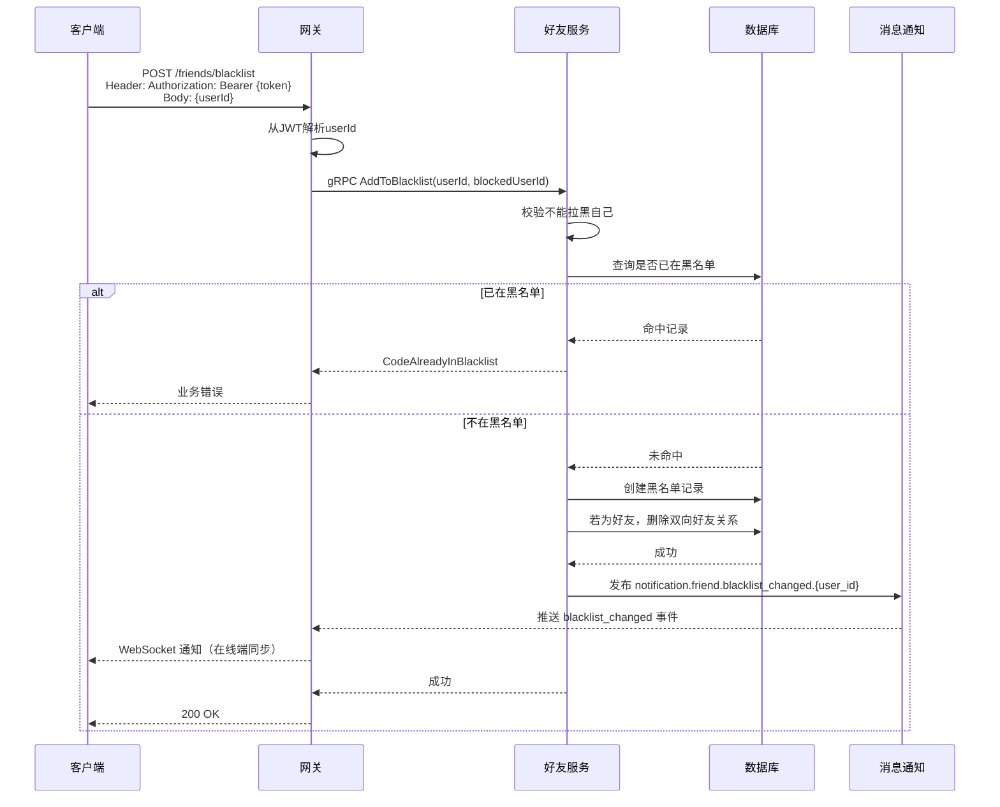
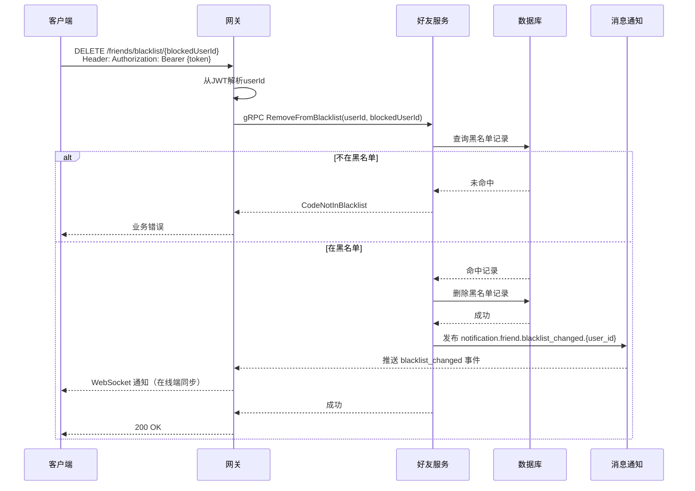
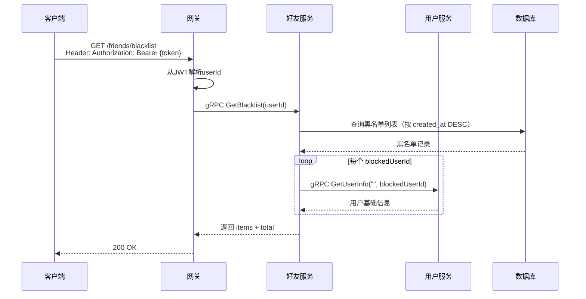
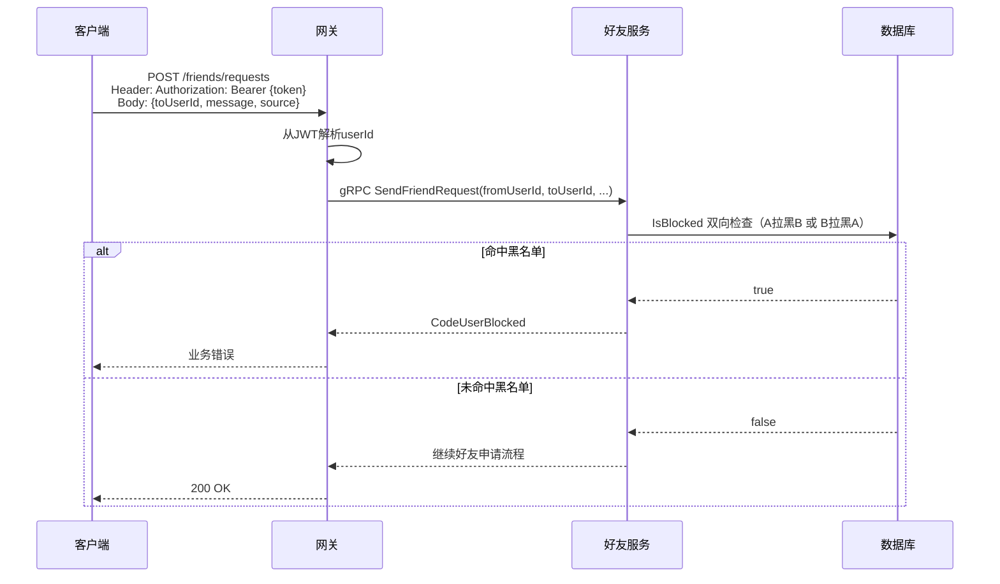

# 黑名单管理设计

## 1. 概述

黑名单管理用于限制特定用户对自己账号的交互能力。

## 2. 功能列表

- [x] 添加到黑名单
- [x] 移出黑名单
- [x] 获取黑名单列表
- [x] 黑名单变更通知（NATS + WebSocket 多端同步）
- [x] 好友申请黑名单拦截
- [x] 拉黑后自动删除好友关系
- [x] 消息发送黑名单拦截
- [x] 音视频通话黑名单拦截

## 3. 数据模型

### 3.1 Blacklist 表

```go
type Blacklist struct {
    ID            int64     // 主键
    UserID        string    // 用户ID
    BlockedUserID string    // 被拉黑用户ID
    CreatedAt     time.Time
}
```

### 3.2 表约束与索引

```sql
CREATE TABLE blacklists (
    id BIGSERIAL PRIMARY KEY,
    user_id VARCHAR(36) NOT NULL,
    blocked_user_id VARCHAR(36) NOT NULL,
    created_at TIMESTAMP NOT NULL DEFAULT CURRENT_TIMESTAMP,
    CONSTRAINT uk_user_blocked UNIQUE (user_id, blocked_user_id)
);

CREATE INDEX idx_blacklists_user_id ON blacklists(user_id);
CREATE INDEX idx_blacklists_blocked_user ON blacklists(blocked_user_id);
```

### 3.3 黑名单响应模型

```protobuf
message BlacklistItem {
    int64 id = 1;
    string user_id = 2;
    string blocked_user_id = 3;
    google.protobuf.Timestamp created_at = 4;
    common.UserInfo blocked_user_info = 5;
}

message GetBlacklistResponse {
    repeated BlacklistItem items = 1;
    int64 total = 2;
}
```

## 4. 业务流程

### 4.1 添加到黑名单



### 4.2 移出黑名单



### 4.3 获取黑名单列表



### 4.4 好友申请黑名单校验



## 5. API设计

### 5.1 添加黑名单

```protobuf
message AddToBlacklistRequest {
    string user_id = 1;
    string blocked_user_id = 2;
}
```

### 5.2 移除黑名单

```protobuf
message RemoveFromBlacklistRequest {
    string user_id = 1;
    string blocked_user_id = 2;
}
```

### 5.3 获取黑名单

```protobuf
message GetBlacklistRequest {
    string user_id = 1;
}

message BlacklistItem {
    int64 id = 1;
    string user_id = 2;
    string blocked_user_id = 3;
    google.protobuf.Timestamp created_at = 4;
    common.UserInfo blocked_user_info = 5;
}

message GetBlacklistResponse {
    repeated BlacklistItem items = 1;
    int64 total = 2;
}
```

### 5.4 检查黑名单（供其他服务调用）

```protobuf
message IsBlockedRequest {
    string user_id = 1;
    string target_user_id = 2;
}

message IsBlockedResponse {
    bool is_blocked = 1;
}
```

## 6. 黑名单限制

已实现：
- [x] 无法添加好友（发送好友申请时进行黑名单双向校验）
- [x] 无法发送消息（Message Service 在单聊发送前校验 `IsBlocked`）
- [x] 无法发起音视频通话（Calling Service 在发起通话前校验 `IsBlocked`）
- [x] 无法查看用户资料（可选，User Service 查询资料前校验 `IsBlocked`）
- [x] 拉黑后自动删除好友关系（FriendService 拉黑事务内执行双向删除）

## 7. 通知主题

- `notification.friend.blacklist_changed.{user_id}` - 黑名单变更通知

### 7.1 通知 Payload

```json
{
    "target_user_id": "user-456",
    "action": "add",
    "changed_at": 1704067200
}
```
