# 群组管理设计

## 1. 概述

群组管理提供群组创建、解散、资料更新、群列表等功能。

## 2. 功能列表

- [x] 创建群组
- [x] 获取群信息
- [x] 更新群资料（名称、头像、公告、群简介）
- [x] 解散群组
- [x] 获取用户群组列表
- [x] 申请入群
- [x] 邀请入群
- [x] 处理入群申请（同意/拒绝）
- [x] 获取入群申请列表
- [x] 群置顶消息
- [x] 全体禁言

## 3. 数据模型

### 3.1 Group 表

```go
type Group struct {
    ID           int64     // 主键 (自增)
    GroupID      string    // 群ID (UUID)
    Name         string    // 群名称
    Avatar       string    // 群头像
    Announcement string    // 群公告
    Description  string    // 群简介
    OwnerID      string    // 群主ID
    MemberCount  int32     // 成员数量
    MaxMembers   int32     // 最大成员数 (默认500)
    IsMuted      bool      // 全体禁言
    Status       int16     // 群状态: 0-已解散 1-正常
    
    CreatedAt    time.Time
    UpdatedAt    time.Time
}
```

### 3.2 GroupMember 表

```go
type GroupMember struct {
    ID            int64      // 主键
    GroupID       string     // 群ID
    UserID        string     // 用户ID
    GroupNickname string     // 群内昵称
    Role          string     // 角色: member/admin/owner
    MutedUntil    *time.Time // 禁言截止时间
                                // nil = 未被禁言
                                // 具体时间 = 定时禁言
                                // 9999-12-31 23:59:59 = 永久禁言
    JoinedAt      time.Time  // 入群时间
    CreatedAt     time.Time
    UpdatedAt     time.Time
}
```

### 3.3 GroupJoinRequest 表

```go
type GroupJoinRequest struct {
    ID        int64     // 主键
    GroupID   string    // 群ID
    UserID    string    // 申请用户ID
    InviterID string    // 邀请人ID (NULL表示主动申请)
    Message   string    // 申请消息
    Status    string    // pending/accepted/rejected
    CreatedAt time.Time
    UpdatedAt time.Time
}
```

### 3.4 GroupPinnedMessage 表

```go
type GroupPinnedMessage struct {
    ID          int64     // 主键
    GroupID     string    // 群ID
    MessageID   string    // 置顶的消息ID
    PinnedBy    string    // 置顶操作者ID
    Content     string    // 消息内容摘要
    CreatedAt   time.Time // 置顶时间
}
```

## 4. 业务流程

### 4.1 创建群组

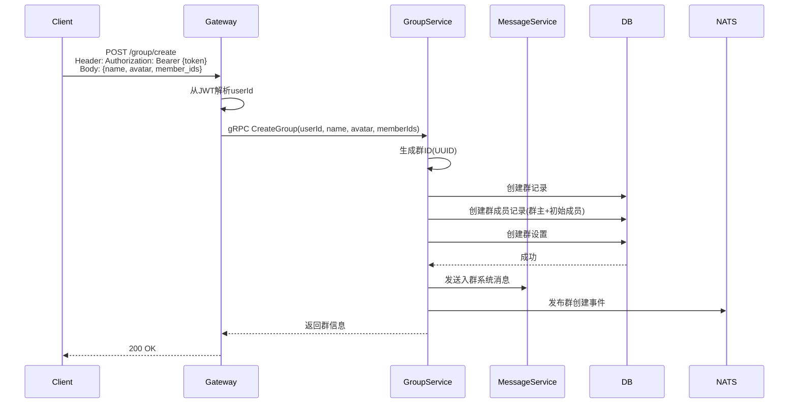

### 4.2 获取群信息

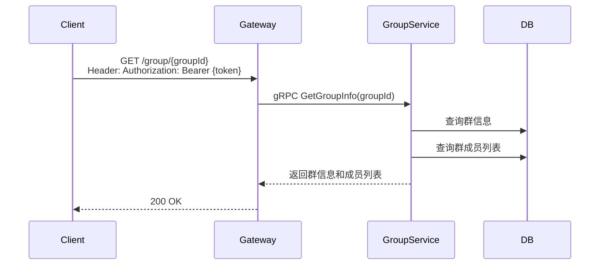

### 4.3 更新群资料

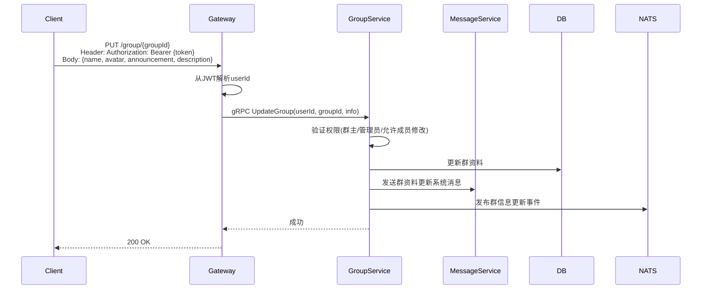

### 4.4 解散群组

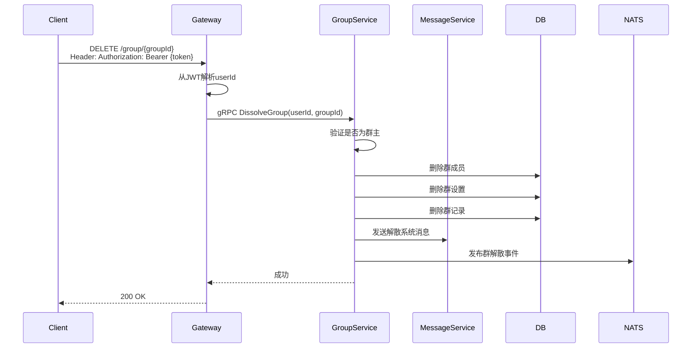

### 4.5 获取用户群组列表

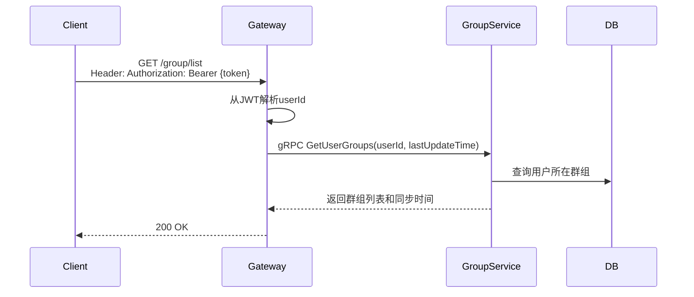

### 4.6 申请入群

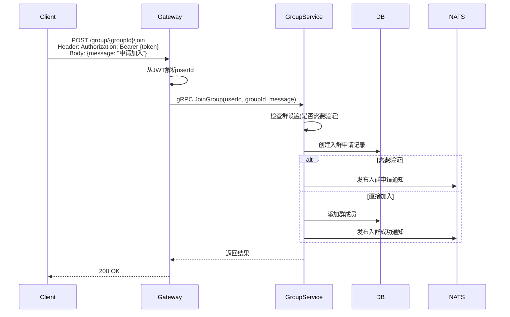

### 4.7 邀请入群

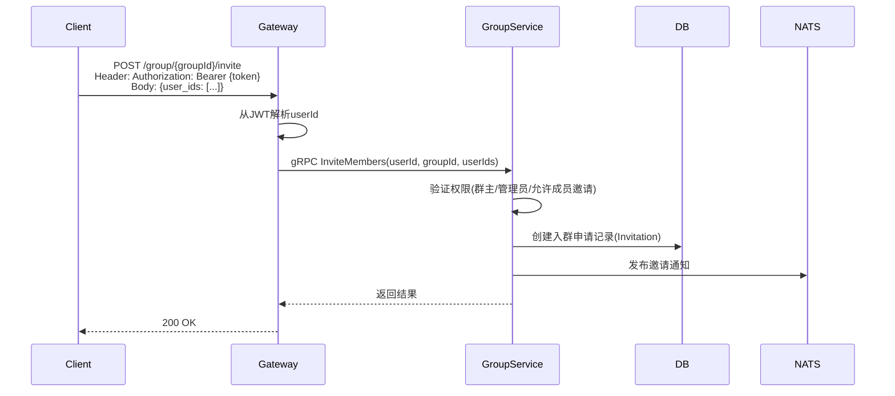

### 4.8 处理入群申请

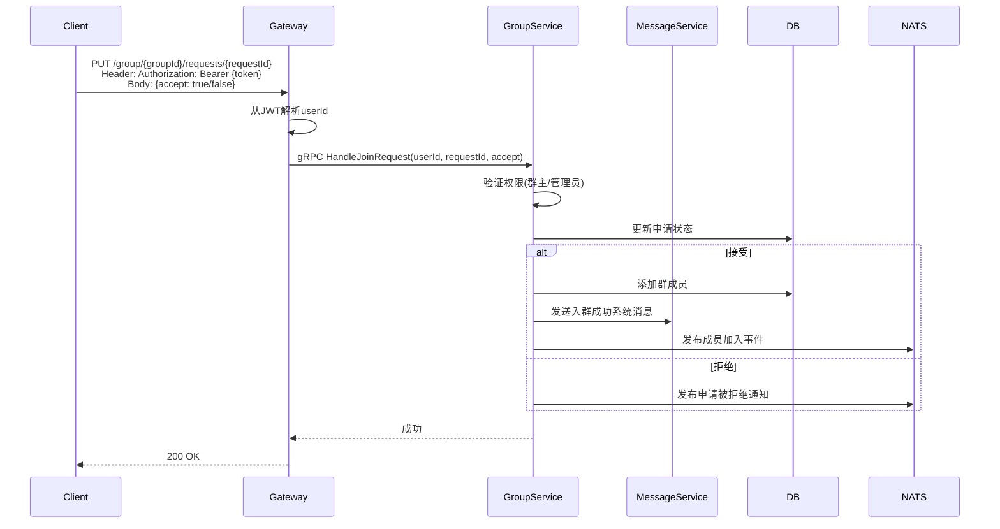

### 4.9 获取入群申请列表

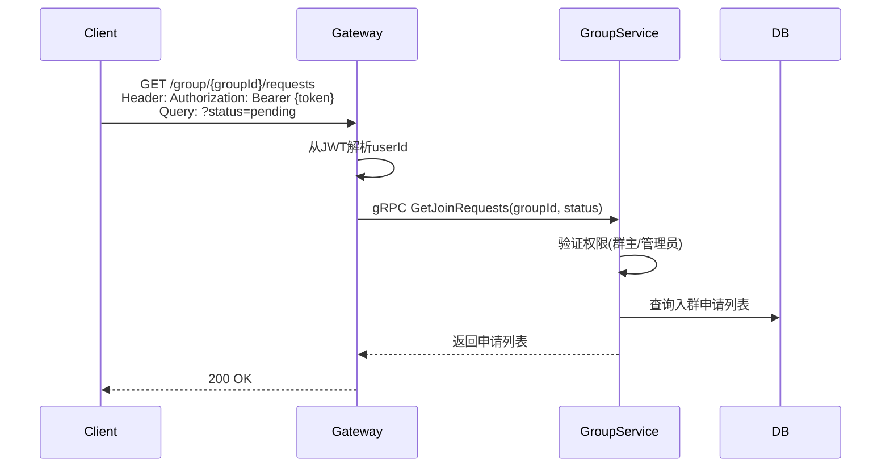

### 4.10 置顶消息

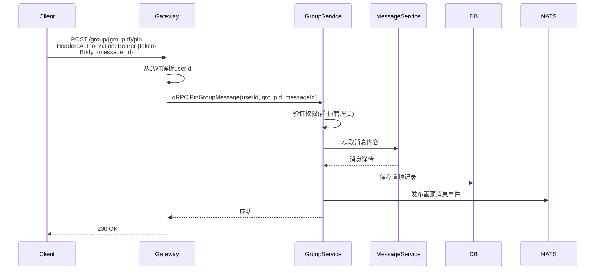

### 4.11 取消置顶

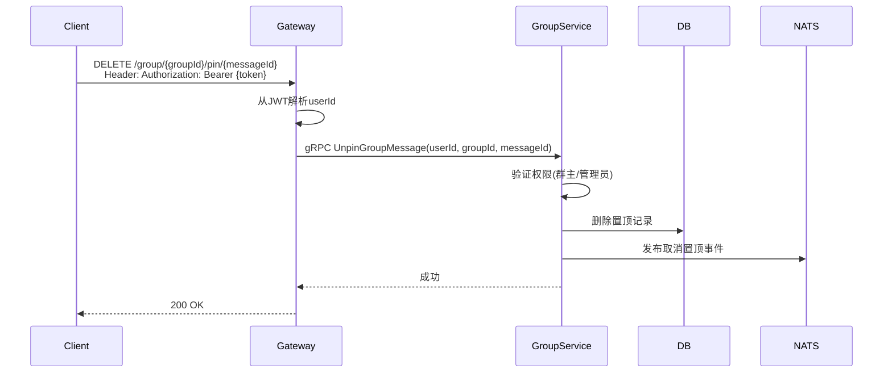

### 4.12 获取置顶消息列表

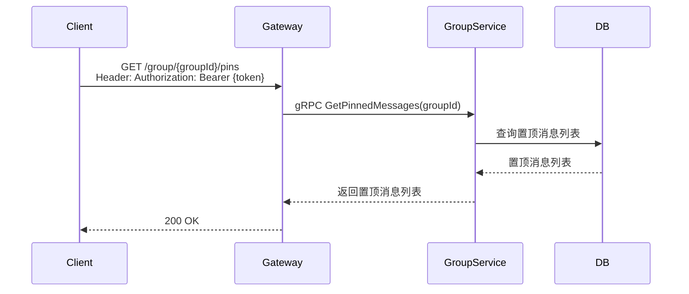

### 4.13 开启/关闭全体禁言

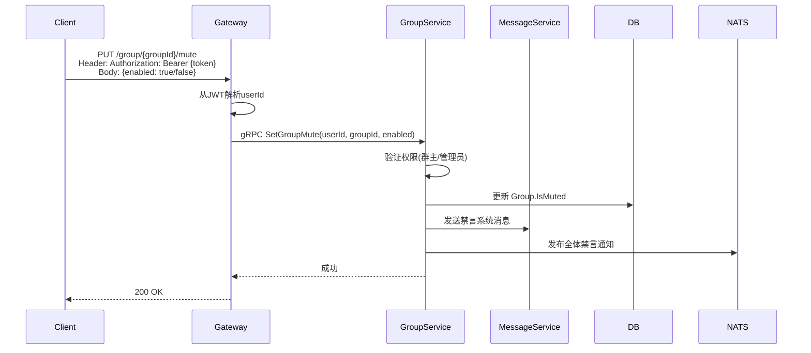

## 5. API设计

### 5.1 创建群组

```protobuf
message CreateGroupRequest {
    string name = 1;
    string avatar = 2;
    repeated string member_ids = 3;
}
```

### 5.2 获取群信息

```protobuf
message GetGroupInfoRequest {
    string group_id = 1;
}

message GetGroupInfoResponse {
    string group_id = 1;
    string name = 2;
    string avatar = 3;
    string announcement = 4;
    string description = 5;
    string owner_id = 6;
    int32 member_count = 7;
    int32 max_members = 8;
    bool join_verify = 9;
    bool is_muted = 10;
    repeated GroupMember members = 11;
}
```

### 5.3 更新群资料

```protobuf
message UpdateGroupRequest {
    string user_id = 1;
    string group_id = 2;
    optional string name = 3;
    optional string avatar = 4;
    optional string announcement = 5;
    optional string description = 6;
}
```

### 5.4 解散群组

```protobuf
message DissolveGroupRequest {
    string user_id = 1;
    string group_id = 2;
}
```

### 5.5 获取用户群组列表

```protobuf
message GetUserGroupsRequest {
    string user_id = 1;
    int64 last_update_time = 2;
}

message GetUserGroupsResponse {
    repeated GroupInfo groups = 1;
    int64 sync_time = 2;
}
```

### 5.6 申请入群

```protobuf
message JoinGroupRequest {
    string user_id = 1;
    string group_id = 2;
    optional string message = 3;
}

message JoinGroupResponse {
    bool need_verify = 1;
    optional int64 request_id = 2;
}
```

### 5.7 邀请入群

```protobuf
message InviteMembersRequest {
    string user_id = 1;
    string group_id = 2;
    repeated string user_ids = 3;
}
```

### 5.8 处理入群申请

```protobuf
message HandleJoinRequestRequest {
    string user_id = 1;
    int64 request_id = 2;
    bool accept = 3;
}
```

### 5.9 获取入群申请列表

```protobuf
message GetJoinRequestsRequest {
    string group_id = 1;
    optional string status = 2;
}

message GetJoinRequestsResponse {
    repeated JoinRequest requests = 1;
    int64 total = 2;
}

message JoinRequest {
    int64 id = 1;
    string group_id = 2;
    string user_id = 3;
    optional string inviter_id = 4;
    optional string message = 5;
    string status = 6;
    google.protobuf.Timestamp created_at = 7;
    optional common.UserInfo user_info = 8;
}
```

### 5.10 置顶消息

```protobuf
message PinGroupMessageRequest {
    string user_id = 1;
    string group_id = 2;
    string message_id = 3;
}

message UnpinGroupMessageRequest {
    string user_id = 1;
    string group_id = 2;
    string message_id = 3;
}

message GetPinnedMessagesRequest {
    string group_id = 1;
}

message PinnedMessage {
    string message_id = 1;
    string content = 2;
    string pinned_by = 3;
    int64 pinned_at = 4;
}

message GetPinnedMessagesResponse {
    repeated PinnedMessage messages = 1;
}
```

### 5.11 全体禁言

```protobuf
message SetGroupMuteRequest {
    string user_id = 1;
    string group_id = 2;
    bool enabled = 3;
}
```

## 6. 通知主题

- `notification.group.disbanded.{group_id}` - 群解散
- `notification.group.info_updated.{group_id}` - 群信息更新
- `notification.group.member_joined.{group_id}` - 成员加入
- `notification.group.member_left.{group_id}` - 成员离开
- `notification.group.member_muted.{group_id}` - 成员禁言
- `notification.group.member_unmuted.{group_id}` - 成员解除禁言
- `notification.group.role_changed.{group_id}` - 成员角色变更
- `notification.group.settings_updated.{group_id}` - 群设置更新
- `notification.group.message_pinned.{group_id}` - 群消息置顶
- `notification.group.message_unpinned.{group_id}` - 群消息取消置顶
- `notification.group.muted.{group_id}` - 全体禁言

## 7. 权限规则

### 群资料与设置

| 操作 | 群主 | 管理员 | 成员 |
|------|------|--------|------|
| 创建群组 | ✓ | ✓ | ✓ |
| 修改群资料 | ✓ | ✓ | ✓* |
| 解散群组 | ✓ | ✗ | ✗ |
| 查看群信息 | ✓ | ✓ | ✓ |

*注：需群设置允许成员修改

### 入群管理

| 操作 | 群主 | 管理员 | 成员 |
|------|------|--------|------|
| 申请加入 | ✓ | ✓ | ✓ |
| 邀请成员 | ✓ | ✓ | ✓* |
| 处理申请 | ✓ | ✓ | ✗ |
| 查看申请列表 | ✓ | ✓ | ✗ |
| 移除成员 | ✓ | ✓ | ✗ |
| 退出群组 | ✓ | ✓ | ✓ |

*注：需群设置允许成员邀请

### 群置顶消息

| 操作 | 群主 | 管理员 | 成员 |
|------|------|--------|------|
| 置顶消息 | ✓ | ✓ | ✗ |
| 取消置顶 | ✓ | ✓ | ✗ |
| 查看置顶消息 | ✓ | ✓ | ✓ |

### 全体禁言

| 操作 | 群主 | 管理员 | 成员 |
|------|------|--------|------|
| 开启全体禁言 | ✓ | ✓ | ✗ |
| 关闭全体禁言 | ✓ | ✓ | ✗ |
