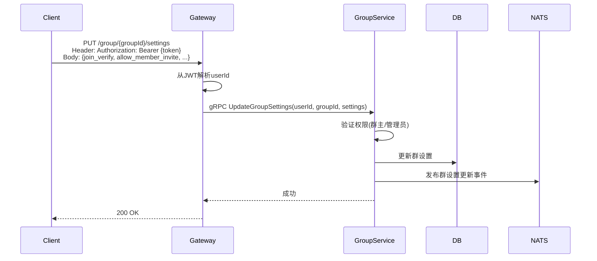
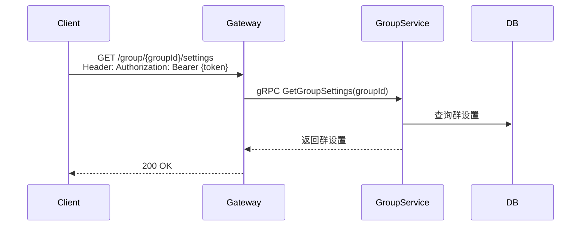

# 群设置管理设计

## 1. 概述

群设置用于管理群的入群验证、权限控制等配置信息，与群基本信息分离存储。

## 2. 数据模型

### GroupSettings 表

```go
type GroupSettings struct {
    GroupID            string    // 群ID (主键)
    JoinVerify         bool      // 是否需要入群验证 (默认true)
    AllowMemberInvite  bool      // 允许成员邀请 (默认true)
    AllowViewHistory   bool      // 允许查看历史消息 (默认true)
    AllowAddFriend     bool      // 允许加好友 (默认true)
    AllowMemberModify  bool      // 允许成员修改群信息 (默认false)
    CreatedAt          time.Time
    UpdatedAt          time.Time
}
```

## 3. 字段说明

| 字段 | 说明 | 默认值 | 权限要求 |
|------|------|--------|----------|
| JoinVerify | 入群是否需要验证 | true | 仅群主/管理员可修改 |
| AllowMemberInvite | 是否允许普通成员邀请好友入群 | true | 仅群主/管理员可修改 |
| AllowViewHistory | 是否允许新成员查看入群前的历史消息 | true | 仅群主/管理员可修改 |
| AllowAddFriend | 是否允许成员之间互相加好友 | true | 仅群主/管理员可修改 |
| AllowMemberModify | 是否允许普通成员修改群名称、头像等资料 | false | 仅群主/管理员可修改 |

## 4. 业务流程

### 4.1 更新群设置



### 4.2 获取群设置



## 5. API设计

### 5.1 更新群设置

```protobuf
message UpdateGroupSettingsRequest {
    string user_id = 1;
    string group_id = 2;
    optional bool join_verify = 3;
    optional bool allow_member_invite = 4;
    optional bool allow_view_history = 5;
    optional bool allow_add_friend = 6;
    optional bool allow_member_modify = 7;
}
```

### 5.2 获取群设置

```protobuf
message GetGroupSettingsRequest {
    string group_id = 1;
}

message GetGroupSettingsResponse {
    string group_id = 1;
    bool join_verify = 2;
    bool allow_member_invite = 3;
    bool allow_view_history = 4;
    bool allow_add_friend = 5;
    bool allow_member_modify = 6;
}
```

## 6. 通知主题

- `notification.group.settings_updated.{group_id}` - 群设置更新

## 7. 权限规则

| 操作 | 群主 | 管理员 | 成员 |
|------|------|--------|------|
| 查看群设置 | ✓ | ✓ | ✓ |
| 修改群设置 | ✓ | ✓ | ✗ |
