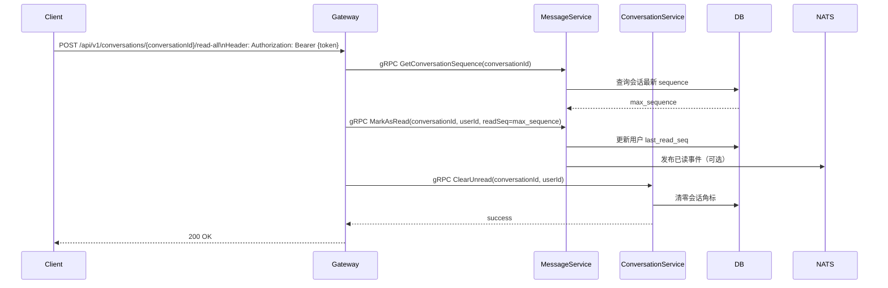
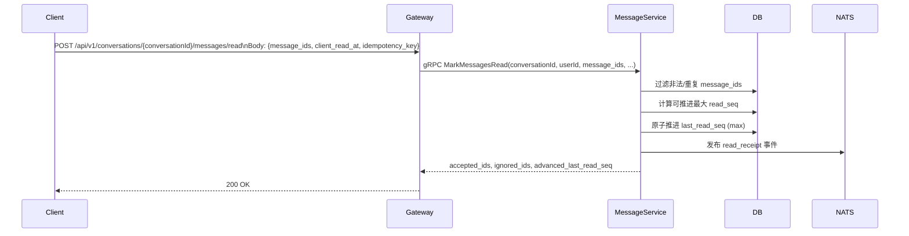
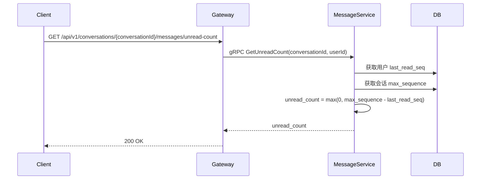

# 消息已读、未读计数与回执设计

## 1. 背景与目标

系统存在两类“已读”语义，需要同时支持并保持一致：

- **会话级已读（Conversation 视角）**：清空会话列表角标；
- **消息级已读（Message 视角）**：推进 `last_read_seq`，用于会话内未读计算与群聊回执展示。

设计目标：

1. 支持一键“本会话全部已读”；
2. 支持按消息 ID 批量标记已读（滚动阅读场景）；
3. 提供单会话未读数、用户总未读数、消息已读回执查询；
4. 统一 HTTP 与 gRPC 语义，避免重复实现和路径分叉。

## 2. 功能范围

- [x] 会话级全部已读
- [x] 消息级批量已读
- [x] 获取会话未读数
- [x] 获取用户总未读数
- [x] 获取消息已读回执（群聊）

## 3. 服务职责划分

- `ConversationService.ClearUnread`
  - 作用：清空会话列表角标；
  - 不维护消息级游标。
- `ConversationService.GetTotalUnread`
  - 作用：查询用户所有会话总未读数。
- `MessageService.MarkAsRead`
  - 作用：推进会话级 `last_read_seq`。
- `MessageService.MarkMessagesRead`
  - 作用：按消息 ID 批量已读，服务端映射到可推进的最大 `read_seq`。
- `MessageService.GetUnreadCount`
  - 作用：查询指定会话未读数。
- `MessageService.GetReadReceipts`
  - 作用：查询消息级已读回执列表（主要用于群聊）。

## 4. 数据模型

### 4.1 MessageReadReceipt

```go
type MessageReadReceipt struct {
    ID             int64     // 主键
    MessageID      string    // 消息ID
    ConversationID string    // 会话ID
    UserID         string    // 已读用户ID
    ReadSeq        int64     // 已读到的序列号
    CreatedAt      time.Time
}
```

说明：

- `ReadSeq` 用于快速判断“某消息是否已读”；
- 群聊已读回执可按消息聚合，展示已读人数与已读用户列表。

## 5. API 设计

### 5.1 HTTP：会话级全部已读

- `POST /api/v1/conversations/:conversationId/read-all`

行为：

1. Gateway 先调用 `MessageService.GetConversationSequence + MarkAsRead`，将 `last_read_seq` 推到当前最大值；
2. 再调用 `ConversationService.ClearUnread` 清空会话角标。

### 5.2 HTTP：按消息 ID 批量已读

- `POST /api/v1/conversations/:conversationId/messages/read`

请求体：

```json
{
  "message_ids": ["msg1", "msg2", "msg3"],
  "client_read_at": 1712550000,
  "idempotency_key": "read-batch-001"
}
```

响应体（data）：

```json
{
  "accepted_ids": ["msg1", "msg2"],
  "ignored_ids": ["msg3"],
  "advanced_last_read_seq": 1024
}
```

### 5.3 HTTP：读取状态查询

- `GET /api/v1/conversations/:conversationId/messages/unread-count`
- `GET /api/v1/conversations/:conversationId/messages/read-receipts`
- `GET /api/v1/conversations/unread/total`

### 5.4 gRPC：核心接口

```protobuf
message MarkAsReadRequest {
    string conversation_id = 1;
    string user_id = 2;
    int64 read_seq = 3;
}

message MarkMessagesReadRequest {
    string conversation_id = 1;
    string user_id = 2;
    repeated string message_ids = 3;
    optional int64 client_read_at = 4;
    optional string idempotency_key = 5;
}

message MarkMessagesReadResponse {
    repeated string accepted_ids = 1;
    repeated string ignored_ids = 2;
    int64 advanced_last_read_seq = 3;
}

message GetUnreadCountRequest {
    string conversation_id = 1;
    string user_id = 2;
}

message GetUnreadCountResponse {
    int64 unread_count = 1;
}
```

## 6. 关键流程

### 6.1 会话级全部已读



### 6.2 按消息 ID 批量已读



### 6.3 查询会话未读数



## 7. 一致性与约束

- `last_read_seq` 仅允许前进，不允许回退；
- 批量已读以服务端可见消息集合为准，不可信任客户端序号；
- `idempotency_key` 推荐作用域为 `(user_id, conversation_id, idempotency_key)`；
- 查询路径统一使用 `GET /api/v1/conversations/:conversationId/messages/*`，避免资源层级混乱。

## 8. 通知主题

- `notification.message.read_receipt.{from_user_id}` - 已读回执通知
