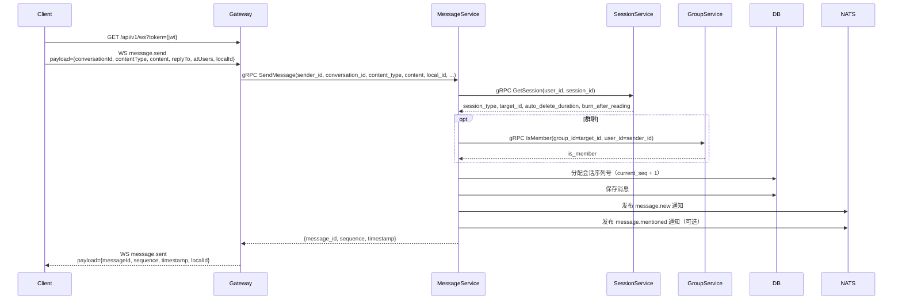
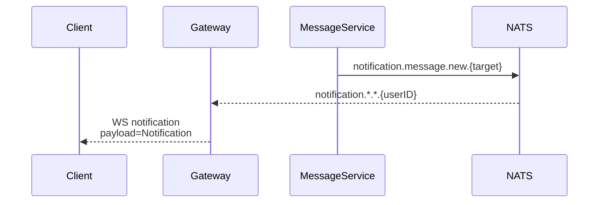
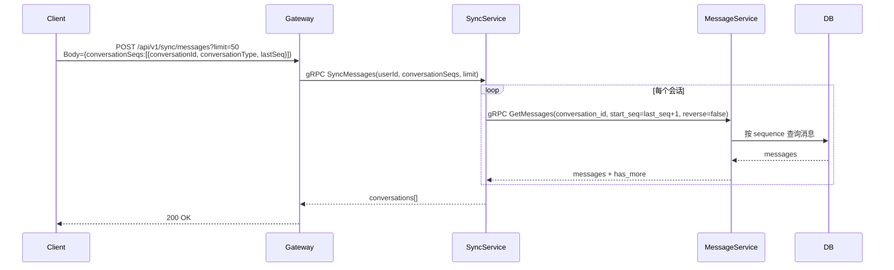

# 消息发送与接收设计

## 1. 概述

消息发送与接收模块负责会话消息的生产、持久化、序列号分配与分发，覆盖以下场景：

- 在线实时发送与接收
- 单聊/群聊统一消息模型
- 离线消息按序补齐
- 提及（@）通知
- 会话级自动删除与阅后即焚策略快照应用

设计目标：

- **顺序性**：同一会话内消息按 `sequence` 单调递增。
- **可追溯**：消息全量落库，支持按序拉取与历史重放。
- **低耦合分发**：通过 NATS 通知总线向在线网关与推送链路分发。
- **多端一致**：在线走实时通知，离线走增量补齐。

## 2. 功能列表

- [x] 发送消息（单聊/群聊）
- [x] 会话内序列号生成
- [x] 基于 `local_id` 的发送幂等
- [x] 增量拉取会话消息
- [x] @提及通知
- [x] 消息过期策略（自动删除/阅后即焚）

## 3. 数据模型

### 3.1 Message

```go
type Message struct {
    MessageID                  string
    ConversationID             string
    ConversationType           string // single/group
    TargetID                   string // single=对方userID, group=groupID
    SenderID                   string
    ContentType                string // text/image/video/audio/file/location/card
    Content                    string // JSON string
    Sequence                   int64  // 会话内递增序号
    ReplyTo                    *string
    AtUsers                    []string
    Status                     int16  // 0-正常 1-撤回 2-删除

    BurnAfterReadingSeconds    int32
    AutoDeleteExpireTime       *time.Time
    BurnAfterReadingExpireTime *time.Time
    ExpireTime                 *time.Time

    CreatedAt time.Time
    UpdatedAt time.Time
}
```

### 3.2 ConversationSequence

```go
type ConversationSequence struct {
    ConversationID string
    CurrentSeq     int64
}
```

用于维护会话维度的最新序列号，保证消息按会话递增。

## 4. 业务流程

### 4.1 发送消息



### 4.2 在线实时接收



客户端在线时通过 WebSocket 实时接收通知事件。

### 4.3 离线消息补齐



## 5. API 设计

### 5.1 WebSocket：发送消息

客户端请求：

```json
{
  "type": "message.send",
  "payload": {
    "conversationId": "single_u1_u2",
    "contentType": "text",
    "content": "{\"text\":\"hello\"}",
    "replyTo": "",
    "atUsers": [],
    "localId": "local-001"
  }
}
```

成功回执：

```json
{
  "type": "message.sent",
  "payload": {
    "messageId": "2f3c...",
    "sequence": 101,
    "timestamp": 1712550000,
    "localId": "local-001"
  }
}
```

### 5.2 gRPC：SendMessage

```protobuf
message SendMessageRequest {
  string sender_id = 1;
  string conversation_id = 2;
  string content_type = 3;
  string content = 4;             // JSON string
  optional string reply_to = 5;
  repeated string at_users = 6;
  string local_id = 7;
}

message SendMessageResponse {
  string message_id = 1;
  int64 sequence = 2;
  google.protobuf.Timestamp timestamp = 3;
}
```

> 约束：`local_id` 在发送场景必须提供，用于幂等去重。
> 服务端基于 `conversation_id` 查询会话并推导 `conversation_type`、`target_id` 及过期策略快照。

### 5.3 gRPC：GetMessages

```protobuf
message GetMessagesRequest {
  string conversation_id = 1;
  optional int64 start_seq = 2;
  optional int64 end_seq = 3;
  int32 limit = 4;
  bool reverse = 5;
}

message GetMessagesResponse {
  repeated Message messages = 1;
  int64 total = 2;
  bool has_more = 3;
}
```

## 6. 消息类型与状态

### 6.1 content_type

- `text`
- `image`
- `video`
- `audio`
- `file`
- `location`
- `card`

### 6.2 status

- `0`：正常
- `1`：撤回
- `2`：删除

## 7. 通知主题

消息相关通知通过统一主题规则发布：

- 用户通知：`notification.{notification_type}.{user_id}`

发送场景涉及：

- `notification.message.new.{receiver_user_id}`（单聊为对端用户，群聊为成员fanout后的用户）
- `notification.message.mentioned.{user_id}`

## 8. 设计约束

- 会话顺序由 `sequence` 保证；客户端应以 `sequence` 作为排序与去重基准。
- 发送请求以 `conversation_id` 作为会话主键，`target_id` 与 `conversation_type` 由服务端从会话数据推导。
- 发送前必须完成会话归属与成员权限校验：单聊校验会话归属，群聊额外校验发送者群成员身份。
- `local_id` 是发送幂等键，作用域为 `(sender_id, conversation_id, local_id)`，重复请求返回同一消息。
- 自动删除与阅后即焚时长以会话配置为准，在发送落库时生成策略快照。
- 单次拉取建议限制数量上限，避免大会话造成单次返回过大。
- 在线链路与离线补齐链路需同时保留，保证弱网/断线场景的最终一致性。
