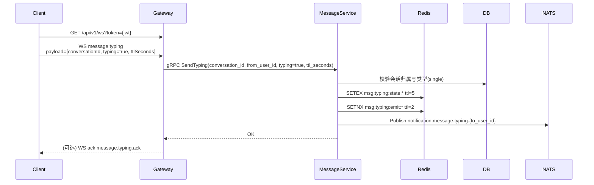
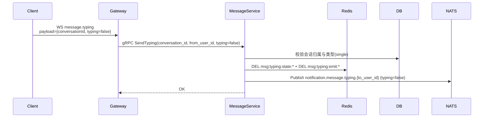

# 正在输入（Typing Indicator）设计

## 1. 概述

“正在输入”用于在单聊场景中提示对方当前正在编辑消息，提升实时沟通反馈感。该能力属于**临时状态同步**，不参与消息持久化、不影响离线同步结果。

## 2. 目标与边界

### 2.1 目标

- [x] 支持单聊会话的“正在输入”状态实时提示
- [x] 延迟低（在线对端通常 < 300ms 可见）
- [x] 自动过期（客户端异常退出时可自动消失）
- [x] 低成本（不落库，Redis + NATS 轻量实现）

### 2.2 非目标

- [ ] 不支持群聊输入态广播（本期）
- [ ] 不提供离线补偿/重放
- [ ] 不进入会话未读数与消息序列体系

## 3. 术语与状态规则

- `typing=true`：发送方正在输入，接收方展示“对方正在输入...”
- `typing=false`：发送方停止输入，接收方立即隐藏提示
- `ttl_seconds`：输入态有效期，默认 `5s`
- 客户端建议节流：输入中每 `3s` 最多发送一次 `typing=true` 心跳

显示规则（接收端）：

1. 收到 `typing=true` 后展示提示，按 `expire_at` 自动隐藏。
2. 收到 `typing=false` 后立即隐藏提示。
3. 超过 `expire_at` 未收到续期事件，自动隐藏提示。

## 4. 总体方案

### 4.1 链路

1. 客户端在 WebSocket 连接上发送 `message.typing` 事件。
2. Gateway 校验连接身份与基础参数后，调用 MessageService gRPC。
3. MessageService 完成会话归属校验（仅允许单聊）并写入 Redis 临时状态。
4. MessageService 通过 NATS 发布 `notification.message.typing.{to_user_id}`。
5. Gateway 订阅用户通知并透传给对端在线连接。

### 4.2 临时状态存储（Redis）

- Key（状态）: `msg:typing:state:{conversation_id}:{from_user_id}`
  - Value: `1`
  - TTL: `5s`（可配置）
- Key（发射去抖）: `msg:typing:emit:{conversation_id}:{from_user_id}`
  - Value: `1`
  - TTL: `2s`
  - 作用：避免高频重复发布 `typing=true`

处理策略：

- `typing=true`：刷新 `state` TTL；若 `emit` 不存在则发布通知并写入 `emit`
- `typing=false`：删除 `state` 与 `emit`，并立即发布停止通知

## 5. 接口设计

### 5.1 WebSocket（Client -> Gateway）

请求类型：`message.typing`

```json
{
  "type": "message.typing",
  "payload": {
    "conversationId": "single_u1_u2",
    "typing": true,
    "ttlSeconds": 5,
    "clientTs": 1744123200
  }
}
```

字段约束：

- `conversationId`：必填
- `typing`：必填
- `ttlSeconds`：可选，范围建议 `3~8`，默认 `5`
- `clientTs`：可选，仅用于观测与排障

错误回执（可选实现，沿用现有错误风格）：

```json
{
  "type": "message.error",
  "payload": {
    "code": "typing_failed",
    "message": "conversation not found"
  }
}
```

### 5.2 gRPC（Gateway -> MessageService）

```protobuf
rpc SendTyping(SendTypingRequest) returns (common.Empty);

message SendTypingRequest {
  string conversation_id = 1;
  string from_user_id = 2;
  bool typing = 3;
  optional int32 ttl_seconds = 4;
  optional string device_id = 5;
}
```

服务端校验：

- `conversation_id`、`from_user_id` 必填
- 会话必须存在且属于请求用户
- 仅允许 `conversation_type=1(single)`

### 5.3 NATS 通知

- Subject: `notification.message.typing.{to_user_id}`
- Notification Type: `message.typing`
- Priority: `low`

Payload：

```json
{
  "conversation_id": "single_u1_u2",
  "from_user_id": "u1",
  "typing": true,
  "expire_at": 1744123205,
  "device_id": "ios-001"
}
```

## 6. 时序图

### 6.1 发送输入中（typing=true）



### 6.2 停止输入（typing=false）



## 7. 限流与可靠性

- Gateway 连接级限流：建议 `1 req/s`，突发 `3`
- MessageService 去抖：`typing=true` 2 秒内最多对同会话发布一次
- 通知语义：至多一次（At-most-once），丢失可由下一次心跳修复
- 服务重启影响：仅丢失临时状态，不影响消息正确性

## 8. 兼容性与灰度

- 协议向后兼容：旧客户端忽略 `message.typing` 通知即可
- 发布顺序建议：
  1. 先发布服务端（支持接收与转发）
  2. 再灰度客户端发送 `message.typing`
  3. 观察指标后全量开启

## 9. 监控指标

- `typing_events_in_total`：输入态请求总量
- `typing_events_out_total`：实际发布通知量
- `typing_events_dropped_total`：限流/去抖丢弃量
- `typing_active_state`：Redis 当前输入态 key 数量
- `typing_end_to_end_latency_ms`：端到端延迟

## 10. 测试计划

### 10.1 单元测试

- `SendTyping` 参数校验（空会话、空用户、非法 ttl）
- 单聊/群聊分支（群聊应拒绝）
- Redis 状态写入、刷新、删除、去抖逻辑

### 10.2 集成测试

- A 输入 -> B 收到 `typing=true`
- A 停止 -> B 收到 `typing=false`
- A 异常断开 -> B 在 `expire_at` 后自动隐藏
- 高频发送 -> 观察去抖与限流生效

### 10.3 回归测试

- 消息发送、已读回执、撤回通知链路无回归
- 网关订阅 `notification.*.*.{userID}` 不受新增类型影响

## 11. 设计决策记录

1. **不落库**：输入态是瞬时状态，不参与离线同步。
2. **单聊优先**：群聊广播成本较高，后续按产品需求扩展。
3. **Redis + NATS**：既满足低延迟，也符合现有通知架构。
