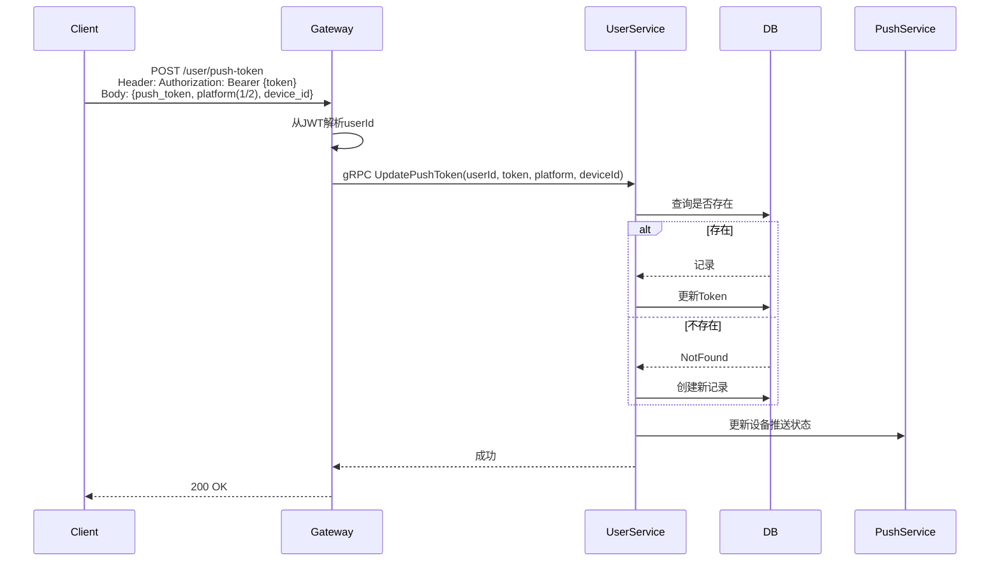

# 推送Token管理设计

## 1. 概述

推送Token管理用于绑定用户设备推送标识，支持多设备离线推送。

## 2. 功能列表

- [x] 绑定推送Token
- [x] 更新推送Token
- [x] 多设备推送Token支持

## 3. 数据模型

```go
type UserPushToken struct {
    ID          string    // 主键
    UserID      string    // 用户ID
    Token       string    // 推送Token
    Platform    int16     // 平台: 1=iOS, 2=Android
    DeviceID    string    // 设备ID
    DeviceType  string    // 设备类型
    CreatedAt   time.Time
    UpdatedAt   time.Time
}
```

## 4. 推送平台

| 枚举值 | 平台 |
|--------|------|
| 1 | iOS |
| 2 | Android |

## 5. 业务流程



## 6. API设计

```protobuf
message UpdatePushTokenRequest {
    string user_id = 1;
    string device_id = 2;
    string push_token = 3;
    PushPlatform platform = 4; // 1-iOS/2-Android
}
```

## 7. 依赖服务

- **PostgreSQL**: Token持久化
- **PushService**: 离线推送
